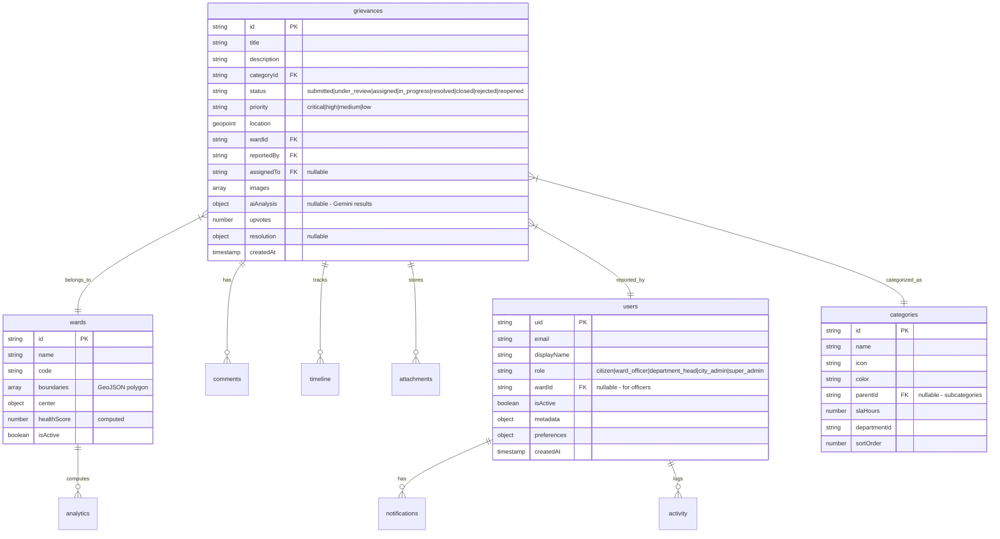
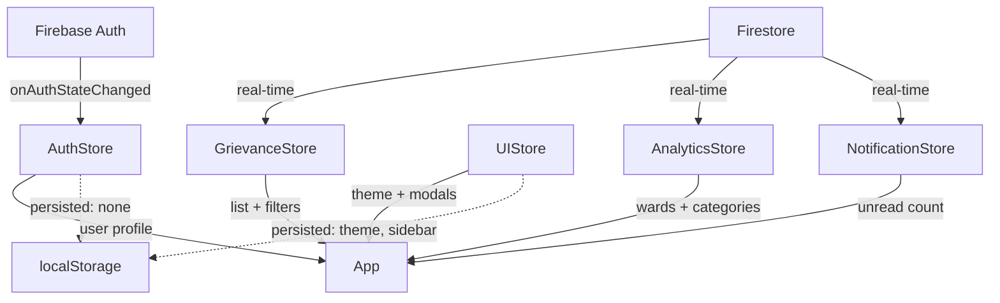
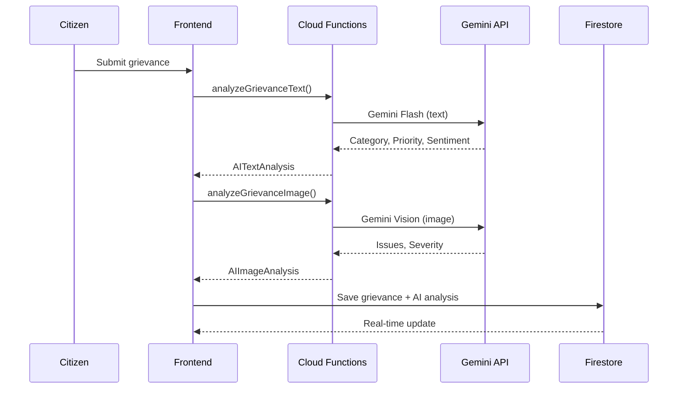

# 🏛️ GRIEVANCEMAP — Architecture Blueprint

> **"Built for the city. Accountable to its people."**

A Civic Intelligence Platform — zero mock data, zero hardcoded values. Everything from Firebase Firestore.

---

## 📁 Folder Structure

```
src/
├── animations/                    # Framer Motion variants & transitions
│   ├── variants.ts                # Page, card, modal, list, pulse animations
│   ├── transitions.ts             # Spring/ease presets, stagger configs
│   └── index.ts
│
├── app/                           # App-level orchestration
│   ├── App.tsx                    # Root component
│   ├── Router.tsx                 # Full route tree with lazy loading + guards
│   └── Providers.tsx              # React Query, Auth initializer
│
├── components/
│   ├── guards/                    # Route protection
│   │   ├── AuthGuard.tsx          # Redirects unauthenticated → /login
│   │   ├── RoleGuard.tsx          # Restricts by UserRole[]
│   │   └── GuestGuard.tsx         # Redirects authenticated → dashboard
│   ├── layout/
│   │   └── AppLayout.tsx          # Sidebar + Topbar + Content shell
│   ├── ui/                        # (Phase 2) Reusable UI primitives
│   ├── maps/                      # (Phase 2) Map components
│   ├── three/                     # (Phase 2) 3D visualizations
│   ├── forms/                     # (Phase 2) Form components
│   └── feedback/                  # (Phase 2) Loading, error, empty states
│
├── config/
│   ├── firebase.ts                # Firebase init (Auth, Firestore, Storage, Functions)
│   ├── firestore.config.ts        # Collection paths & path builders
│   ├── firestore.rules.ts         # Security rules documentation
│   ├── constants.ts               # Roles, statuses, priorities, config
│   ├── routes.ts                  # Route paths, metadata, role→route mapping
│   └── index.ts
│
├── features/                      # Feature-based page modules
│   ├── admin/                     # 8 admin pages
│   ├── auth/                      # Login, Register, ForgotPassword
│   ├── dashboard/                 # Citizen dashboard
│   ├── errors/                    # 404, Unauthorized
│   ├── grievances/                # Submit, MyGrievances, GrievanceDetail
│   ├── landing/                   # Public landing page
│   ├── map/                       # City map with Leaflet
│   ├── notifications/             # Notification center
│   ├── officer/                   # Officer dashboard + queue
│   └── profile/                   # User profile
│
├── hooks/
│   ├── useAuth.ts                 # Firebase auth state listener
│   ├── useFirestoreData.ts        # Generic Firestore fetch hook
│   ├── useMediaQuery.ts           # Responsive breakpoints
│   └── index.ts
│
├── lib/
│   └── ai/
│       ├── gemini.service.ts      # Gemini Flash/Vision via Cloud Functions
│       └── index.ts
│
├── services/                      # Firebase service layer
│   ├── auth.service.ts            # Sign-in/up/out, profile CRUD
│   ├── grievance.service.ts       # Full CRUD, pagination, comments, timeline
│   ├── analytics.service.ts       # Wards, categories, city analytics, health
│   ├── storage.service.ts         # File uploads with progress tracking
│   ├── notification.service.ts    # Real-time notification subscription
│   └── index.ts
│
├── stores/                        # Zustand state management
│   ├── auth.store.ts              # Auth state, role checks
│   ├── grievance.store.ts         # List, filters, pagination, active item
│   ├── ui.store.ts                # Theme, sidebar, modals, toasts (persisted)
│   ├── analytics.store.ts         # Wards, categories, snapshots, AI insights
│   ├── notification.store.ts      # Notification list, unread count
│   └── index.ts
│
├── types/
│   ├── auth.types.ts              # UserProfile, AuthState, credentials
│   ├── grievance.types.ts         # Grievance, AIAnalysis, Resolution, Timeline
│   ├── analytics.types.ts         # Ward, Category, Snapshots, Health, Insights
│   ├── common.types.ts            # ApiResponse, MapMarker, UI types
│   └── index.ts
│
├── utils/
│   ├── cn.ts                      # clsx + tailwind-merge
│   ├── date.utils.ts              # Firestore timestamp formatting, SLA tracking
│   ├── format.utils.ts            # Status/priority labels, colors, numbers
│   ├── validation.utils.ts        # Zod schemas for all forms
│   ├── geo.utils.ts               # Haversine, point-in-polygon, ward lookup
│   └── index.ts
│
├── styles/
│   └── index.css                  # TailwindCSS v4 entry
│
├── main.tsx                       # Application entry point
└── vite-env.d.ts                  # Env variable type declarations
```

---

## 🔥 Firestore Collection Schema



---

## 🛡️ Role-Based Access Control

| Feature | Citizen | Ward Officer | Dept Head | City Admin | Super Admin |
|---|:---:|:---:|:---:|:---:|:---:|
| Submit grievance | ✅ | — | — | — | — |
| View own grievances | ✅ | — | — | — | — |
| View city map | ✅ | ✅ | ✅ | ✅ | ✅ |
| Officer dashboard | — | ✅ | ✅ | — | — |
| Grievance queue | — | ✅ | ✅ | — | — |
| Assign grievances | — | ✅ | ✅ | ✅ | ✅ |
| Admin dashboard | — | — | — | ✅ | ✅ |
| Analytics | — | — | — | ✅ | ✅ |
| Manage users | — | — | — | ✅ | ✅ |
| Manage wards | — | — | — | ✅ | ✅ |
| Manage categories | — | — | — | ✅ | ✅ |
| System settings | — | — | — | — | ✅ |
| AI insights | — | — | — | ✅ | ✅ |

---

## 🔀 Route Architecture

| Path | Page | Guard | Roles |
|---|---|---|---|
| `/` | Landing | — | Public |
| `/login` | Login | GuestGuard | Public |
| `/register` | Register | GuestGuard | Public |
| `/dashboard` | Citizen Dashboard | AuthGuard | citizen |
| `/grievances/submit` | Submit Grievance | AuthGuard | citizen |
| `/grievances/my` | My Grievances | AuthGuard | citizen |
| `/grievances/:id` | Grievance Detail | AuthGuard | all |
| `/map` | City Map | AuthGuard | all |
| `/officer/dashboard` | Officer Dashboard | Auth + RoleGuard | ward_officer, dept_head |
| `/officer/queue` | Grievance Queue | Auth + RoleGuard | ward_officer, dept_head |
| `/admin/dashboard` | Admin Dashboard | Auth + RoleGuard | city_admin, super_admin |
| `/admin/analytics` | Analytics | Auth + RoleGuard | city_admin, super_admin |
| `/admin/heatmap` | Civic Heatmap | Auth + RoleGuard | city_admin, super_admin |
| `/admin/ai-insights` | AI Insights | Auth + RoleGuard | city_admin, super_admin |
| `/admin/users` | User Management | Auth + RoleGuard | city_admin, super_admin |
| `/admin/wards` | Ward Management | Auth + RoleGuard | city_admin, super_admin |
| `/admin/categories` | Category Mgmt | Auth + RoleGuard | city_admin, super_admin |
| `/admin/settings` | System Settings | Auth + RoleGuard | super_admin |

---

## 🧠 Zustand Store Architecture



---

## 🤖 AI Pipeline (Gemini)



---

## ✅ Architecture Status

| Layer | Status | Files |
|---|---|---|
| Firebase Config | ✅ Complete | `config/firebase.ts` |
| Firestore Schema | ✅ Complete | `config/firestore.config.ts` |
| Security Rules | ✅ Complete | `config/firestore.rules.ts` |
| TypeScript Types | ✅ Complete | `types/*.ts` (4 files) |
| Zustand Stores | ✅ Complete | `stores/*.ts` (5 stores) |
| Auth Service | ✅ Complete | `services/auth.service.ts` |
| Grievance Service | ✅ Complete | `services/grievance.service.ts` |
| Analytics Service | ✅ Complete | `services/analytics.service.ts` |
| Storage Service | ✅ Complete | `services/storage.service.ts` |
| Notification Service | ✅ Complete | `services/notification.service.ts` |
| AI Service (Gemini) | ✅ Complete | `lib/ai/gemini.service.ts` |
| Route Architecture | ✅ Complete | `app/Router.tsx` |
| Route Guards | ✅ Complete | `components/guards/*.tsx` |
| Validation (Zod) | ✅ Complete | `utils/validation.utils.ts` |
| Animation System | ✅ Complete | `animations/*.ts` |
| Utility Layer | ✅ Complete | `utils/*.ts` (5 files) |
| Custom Hooks | ✅ Complete | `hooks/*.ts` (3 hooks) |
| Vite Config | ✅ Complete | `vite.config.ts` |
| Feature Placeholders | ✅ Complete | `features/**/*.tsx` (20 pages) |

> **TypeScript compilation: ✅ ZERO errors**

---

